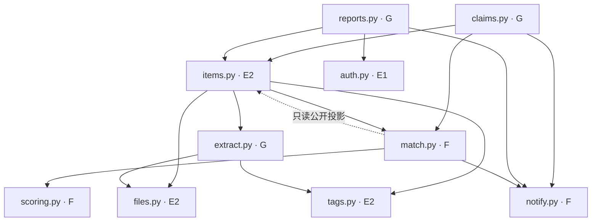
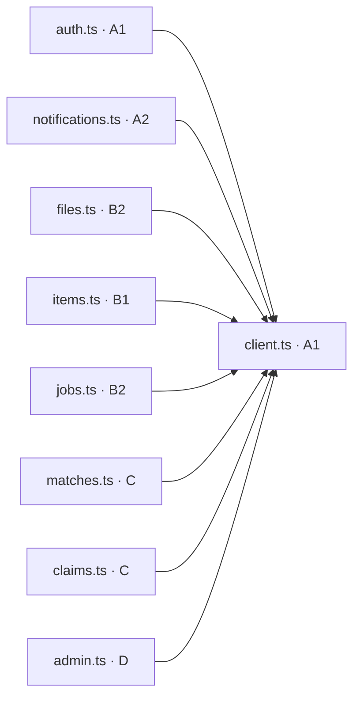

# 依赖关系

箭头表示「可以调用」。规则正文在 `软件设计说明书.md` 第 4 节。组员在 GitHub 上打开本文件就能看到图。交互版在 Cursor 里打开画布「文件依赖」。

`schemas.py`、`errors.py`、`frontend/src/api/types.ts`、`main.py` 谁都可以引用，图里不画。改字段或函数名先改文档，由组长改这四个文件。

## 后端

虚线是唯一允许的回头：`match.py` 只能调用 `items.to_public_view`，不能调用 `create_item` 或 `update_item`。

路由比服务少一层。例如 `api/items.py` 只调用 `items.py`，再由 `items.py` 去调用别人。路由里不打分、不改状态、不插通知。写操作的路由都可以调用 `idempotency.py`。

## 前端

`redact.ts` 不在这张图里。涂黑发生在浏览器里，不发请求，所以不依赖 `client.ts`。

拾获页面的操作顺序是：`redact.ts` → `files.ts` → `items.ts` → `jobs.ts` → `items.ts` 确认标签。这是先后顺序，不是 import。

## 不许反着接

| 调用方 | 不能做的事 |
| --- | --- |
| `extract.py` | 调用 `match.py` |
| `scoring.py` | 调用任何业务模块 |
| `match.py` | 调用 `create_item` 或 `update_item` |
| `files.py` | 引用 `match.py` |
| 路由 | 自己打分、改状态、插通知 |
| 前端各文件 | 各自写一套 `fetch` |
